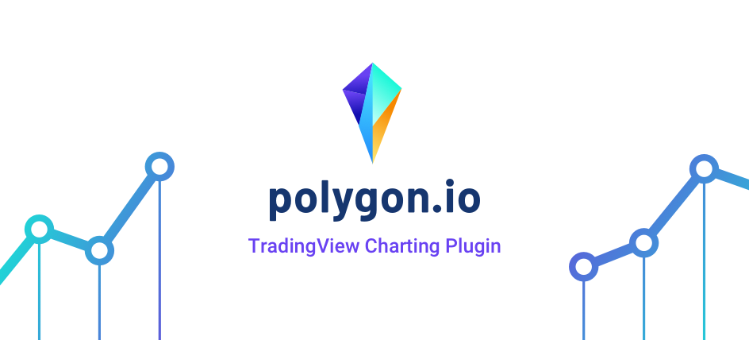

<p align="center">
	
</p>

<div align="center">
	<h1>Polygon.io TradingView Adapter</h1>
	JS Library for using Polygon.io with TradingView charting.
</div>

### Installation

		npm i @polygon.io/tradingview-adapter --save-dev

### Usage

```javascript

import PolygonAdapter from '@polygon.io/tradingview-adapter'

const client = new PolygonAdapter({
	apikey: 'YOUR_APIKEY',
	realtimeEnabled: true 	// True(default) = Use websockets for updates. False = use polling for new data.
})

const widget = new TradingView.widget({
	fullscreen: true,
	symbol: 'AAPL',
	interval: '1D',
	timezone: 'America/New_York',
	container_id: "tv_chart_container", /* ID of the container element */
	datafeed: client, /* Our Polygon.io Adapter */
	library_path: "/charting_library/", /* Where your TV Library files reside */
	locale: "en",
	disabled_features: ["use_localstorage_for_settings"],
	enabled_features: ["study_templates"],
	charts_storage_url: 'http://saveload.tradingview.com',
	charts_storage_api_version: "1.1",
	client_id: 'tradingview.com',
	user_id: 'public_user_id',
	theme: 'Light', /* Light or Dark */
})

```

Currently only stocks are supported at 1min and 1day intervals. This will be fixed soon.